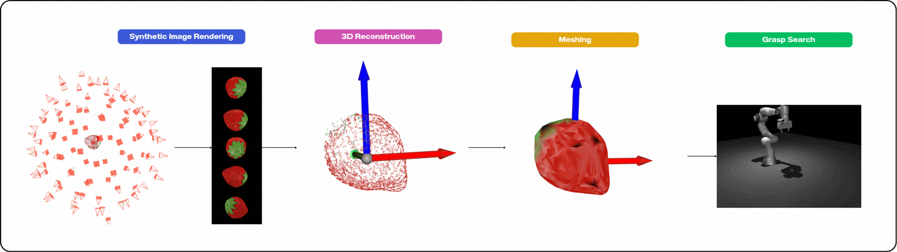

# Robot Grasping

A framework for evaluating how **3D reconstruction quality impacts robotic grasp success**, using synthetic rendering, photogrammetric reconstruction, and physics-based grasp simulation.

<p align="center">
  
</p>

## Motivation

Robotic grasping in unstructured environments depends on accurate 3D models of target objects. In practice, these models are obtained through reconstruction pipelines — but reconstruction is imperfect, and geometric errors propagate directly into grasp planning. This project asks a concrete question:

> **How much does reconstruction fidelity matter, and where does it matter most?**

To answer it, we build a controlled evaluation loop: objects from the [YCB dataset](https://www.ycbbenchmarks.com/) are rendered synthetically under known camera trajectories, reconstructed with photogrammetric tools (e.g. COLMAP / Depth Anything / Triangulation + Poisson / Alpha Shape meshing), and then used to plan grasps on a simulated Franka Emika Panda arm in MuJoCo. Because the ground-truth geometry is known, reconstruction error can be measured precisely and correlated with grasp outcome metrics (success rate, grasp stability, contact quality).

This lets us benchmark reconstruction pipelines not by geometric metrics alone (Chamfer distance, F-score) but by their **downstream effect on a real manipulation task**.

## Pipeline

The synthetic pipeline uses **Blender** to render YCB objects from configurable camera trajectories, giving full control over lighting, camera count, resolution, and noise so reconstruction difficulty can be varied systematically. The AruCo-based pipeline replaces synthetic images with real captures, enabling the same evaluation on physical setups.

## Installation

```sh
git clone <git_url>
git submodule update --init --recursive
```

```sh
pip install uv
```

## Usage

### Synthetic pipeline

Renders YCB objects with Blender, reconstructs plans and simulates grasps.

```sh
uv run python3 -m scripts.run_grasp_generation_simulation --verbose
```

### AruCo-based pipeline

Uses AruCo marker boards for camera pose estimation from real images instead of synthetic rendering.

```sh
uv run python3 -m scripts.run_grasp_generation_aruco --verbose
```
